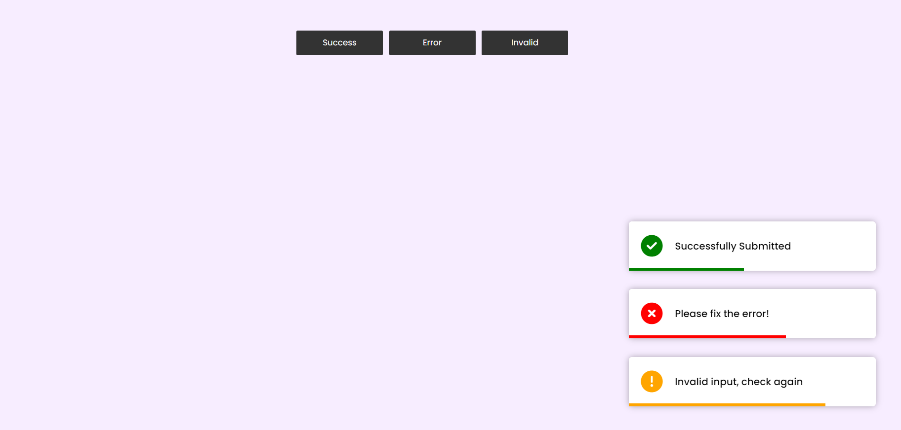

# Toast Notification

A simple and interactive toast notification application built with HTML, CSS, and JavaScript. This app allows users to display notifications.

## Visit the Website

[Toast Notification](https://maheshhattimare.github.io/toast-notification/)

## Features

- User-friendly interface
- Buttons to manually show and hide the toast notification

## Technologies Used

- HTML 
- CSS
- JavaScript

## Screenshots

### Interface


## Installation

1. Clone the repository:
    ```bash
    git clone https://github.com/maheshhattimare/toast-notification.git
    ```
2. Navigate to the project directory:
    ```bash
    cd toast-notification    ```
3. Open `index.html` in your web browser to start the application.

## Usage

1. Open the `index.html` file in your preferred web browser.
2. Click the "Button(s)" button to display the toast notification.
3. The toast will automatically fade out after 6 seconds.
